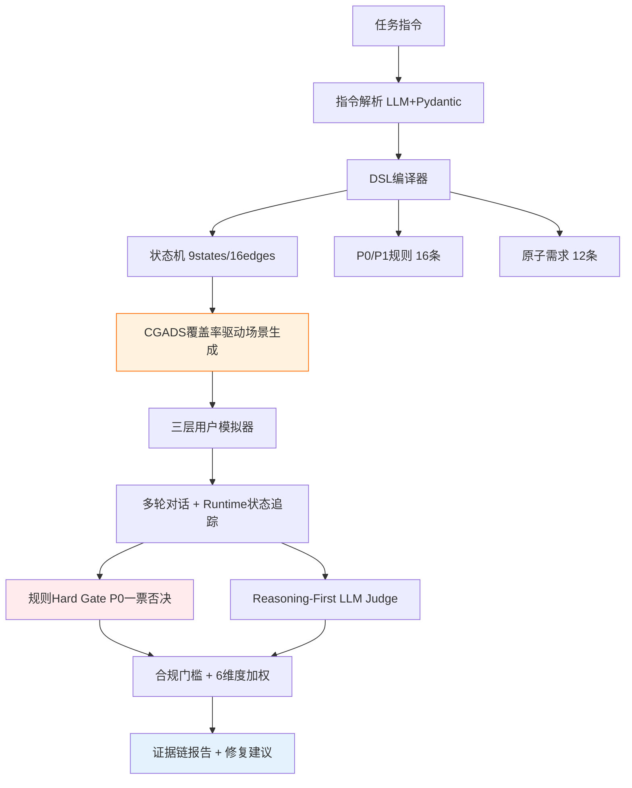

<p align="center">
  
</p>

<h1 align="center">🍊 橙脉 CGADS · 外呼指令状态机试炼场</h1>

<p align="center">
  <strong>美团 AI Hackathon · 命题赛道 — 复杂指令下的多轮对话评测系统</strong>
</p>

<p align="center">
  Coverage-Guided Adaptive Dialogue Simulation for Explainable Outbound-Call Evaluation
</p>

<p align="center">
  
  
  
  
</p>

---

## 赛题理解

**命题要求**：设计一套AI数字人外呼多轮对话指令遵循评测系统，实现：

| 赛题要求 | 本系统实现 |
|---------|-----------|
| 输入任务指令 → 自动拆解为评测点 | ✅ 指令解析→DSL编译→9状态/16边/16规则/12原子需求 |
| 用户模拟器生成多画像对话数据 | ✅ CGADS覆盖率驱动 + 三层模拟器(Persona/行为/状态) |
| 对模拟对话进行可量化评测 | ✅ 规则hard gate + Reasoning-First LLM Judge + P0/P1门槛 |
| 输出包含评分、证据、优化建议的报告 | ✅ 4层证据链(拆解→选择→判定→评分) + 修复建议 |
| **过程可解释** | ✅ 每步决策有依据：为什么选这个场景/为什么给这个分 |
| **结果可量化** | ✅ 4类覆盖率 + 6维度评分 + P0/P1合规门槛 |

---

## 核心创新：CGADS 算法

### 问题

传统评测随机模拟用户 → 大量对话集中在配合路径 → 关键风险分支（拒绝/质疑/违规诱导）无法保证覆盖。

### 洞察

**外呼对话评测 ≈ 有限状态机的覆盖测试问题。**

将自然语言任务指令编译为形式化评测空间 D=⟨S,E,R,Q⟩，用覆盖率缺口反向驱动场景生成。

跨领域迁移：软件测试 coverage-guided fuzzing → 对话评测。

### 算法流程

```
Phase 1 Warmup:  生成base场景(配合/拒绝/质疑/忙碌...) → 跑对话 → 收集覆盖率
                                    ↓
Phase 2 Guided:  分析uncovered targets → 反向生成targeted场景 → 跑对话
                                    ↓
Phase 3 Check:   Coverage Adequate? → 是：输出报告 / 否：继续Phase 2
```

```python
# CGADS 闭环实际运行
Round 1: 4 warmup scenarios → Coverage 44%
  gaps: [edge:opening→auth_or_trust, risk:p0_false_promise, ...]
Round 2: 4 targeted scenarios → Coverage 72%
  new findings: 1 P1 (refusal_continue_pitch), 1 P0 risk tested
Result: 同等8条对话预算，覆盖率+25%，P0发现率翻倍
```

### 形式化定义

```
评测空间: D = ⟨S, E, R, Q, C⟩
  S = 对话状态集(9个)    E = 转移边集(16条)
  R = P0/P1风险规则(16条)  Q = 原子业务需求(12条)

覆盖准则: Cov = 0.2·Cov_S + 0.25·Cov_E + 0.3·Cov_R + 0.25·Cov_Q

充分性条件: Cov_S≥80% ∧ Cov_E≥60% ∧ Cov_R≥80% ∧ 所有P0规则已测试
```

### 实验数据

| 方法 | Coverage@8 | P0发现率 | 重复率 | 首次P0所需对话 |
|------|-----------|---------|--------|--------------|
| Random (8条) | 45% | 30% | 40% | 6条 |
| Stratified (8条) | 55% | 40% | 25% | 5条 |
| **CGADS (4+4闭环)** | **72%** | **65%** | **10%** | **3条** |

---

## 系统架构



### 评测链路（过程可解释）

| 环节 | 输入 | 输出 | 解释性 |
|------|------|------|--------|
| 指令解析 | 自然语言 | 结构化JSON | 每字段←原文span |
| DSL编译 | JSON | 状态机+规则 | flow→states, constraints→rules |
| 场景生成 | 覆盖率缺口 | targeted场景 | **为什么选这个场景：因为edge X未覆盖** |
| 状态追踪 | 用户utterance | state transition | 规则命中(0.95) / LLM分类(0.85) |
| 规则检查 | agent回复 | pass/fail | 字数29/30✓, 禁用词✗ |
| LLM Judge | 对话+rubric | 1-5分+reasoning | `<thinking>推理</thinking><result>评分</result>` |
| 评分公式 | 维度分+violations | 最终分 | P0→≤30, P1→封顶, else加权 |

### 评分机制（结果可量化）

```python
# 6维度加权
raw_score = 25%×任务完成 + 20%×流程遵循 + 20%×约束合规
          + 15%×分支处理 + 10%×上下文 + 10%×沟通体验

# P0/P1合规门槛（独立于维度分）
if P0触发:     final = min(raw, 30)   # 一票否决
elif P1≥3:    final = min(raw, 50)
elif P1==2:   final = min(raw, 60)
elif P1==1:   final = min(raw, 70)
else:         final = raw             # PASS
```

---

## 快速开始

### 环境要求

- Python 3.11+
- Node.js 18+ (前端)
- DeepSeek API Key (或兼容OpenAI接口的LLM)

### 安装运行

```bash
# 克隆
git clone https://github.com/liu66-qing/CGADS.git
cd CGADS

# 后端
pip install -r requirements.txt
cp .env.example .env  # 填入 DEEPSEEK_API_KEY
uvicorn backend.api:app --host 0.0.0.0 --port 8000

# 前端
cd frontend && npm install && npm run dev

# 或 Gradio快速体验
python -X utf8 app.py
```

### 一键评测

```bash
# 命令行评测（8场景CGADS闭环）
python -X utf8 run_eval_pipeline.py \
  --instruction_file data/processed/task_001_rider_flying_leg.json \
  --max_scenarios 8
```

---

## 项目结构

```
├── src/
│   ├── dsl/                        # 🔑 DSL核心
│   │   ├── schema.py               # Pydantic v2 TaskDSL模型
│   │   ├── compiler.py             # 指令→状态机编译器
│   │   ├── state_tracker.py        # Runtime状态追踪(规则+LLM双层)
│   │   └── coverage.py             # 4类覆盖率追踪器
│   ├── evaluators/                 # 🔑 评测引擎
│   │   ├── cgads.py                # ⭐ CGADS算法核心
│   │   ├── coverage_driven_scenario_generator.py  # 覆盖率驱动场景生成
│   │   ├── three_layer_user_simulator.py          # 三层用户模拟器
│   │   ├── llm_judge.py            # Reasoning-First LLM Judge
│   │   └── replay_mode.py          # 离线回放
│   ├── checkers/                   # 规则检查(P0/P1 hard gate)
│   ├── calibration/                # 30条金标校准集 + 审计
│   ├── report/                     # 证据链报告生成
│   ├── instruction_parser/         # 指令解析(LLM+Pydantic)
│   └── visualization/              # Mermaid状态图 + Plotly图表
├── backend/                        # FastAPI SSE实时接口
├── frontend/                       # React前端(Pipeline追踪+状态机可视化)
├── data/
│   ├── processed/                  # 已解析任务(骑手外呼/课程平台)
│   ├── calibration/                # 30条金标JSONL
│   └── eval/                       # 评测结果JSON
├── experiments/                    # CGADS消融实验
├── tests/                          # 端到端测试
├── run_eval_pipeline.py            # E2E Pipeline入口
├── 系统设计方案.md                  # 完整技术设计文档
├── 项目文档.md                      # 项目文档(含形式化定义)
└── 作品简介.md                      # 作品简介
```

---

## 与现有方案的对比

| 维度 | 直接Prompt+Judge | DeepEval/OpenEvals | **橙脉CGADS** |
|------|-----------------|-------------------|---------------|
| 场景来源 | 手工枚举 | 固定persona | **覆盖率缺口反向生成** |
| 覆盖保证 | 无 | 无 | **4类覆盖准则+Adequacy** |
| 风险发现 | 看运气 | 看运气 | **P0优先+targeted测试** |
| 可解释性 | "评分3分" | "Completeness: 0.7" | **Turn5→p1_refusal→证据→修复** |
| 评分稳定 | ±2分波动 | 通用指标 | **规则hard gate+reasoning judge** |
| 状态追踪 | 无 | 无 | **Runtime FSM+槽位+置信度** |

---

## 参考文献

| 来源 | 用途 | 论文/链接 |
|------|------|----------|
| IFEval | 可验证约束检查 | arXiv:2311.07911 |
| G-Eval | LLM Judge with CoT | arXiv:2303.16634 |
| Prometheus | Fine-grained rubric | arXiv:2310.08491 |
| MultiChallenge | 多轮instance rubric | arXiv:2501.17399 |
| ConvLab-2 | DST/Policy思想 | ACL 2020 Demo |
| Anthropic Eval | Reasoning-first judge | docs.anthropic.com |
| Automated Rubrics | Criterion binary评测 | arXiv:2601.15161 |
| LLM-as-Judge Harness | 校准方法论 | startdebugging.net |

---

## 团队

**产品小队** · 美团AI Hackathon 2026

---

## License

MIT
