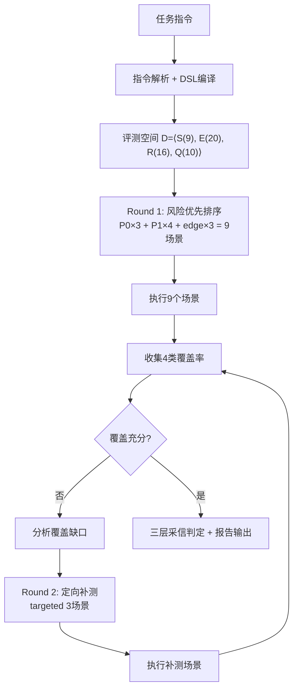
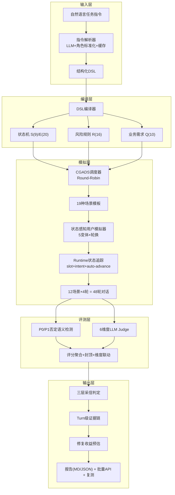
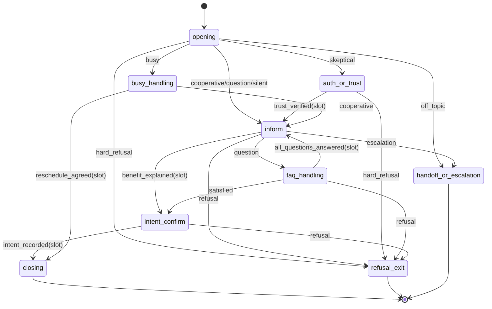

<p align="center">
  
</p>

<h1 align="center">橙脉 CGADS · AI数字人外呼多轮对话评测系统</h1>

<p align="center">
  <strong>美团 AI Hackathon 2026 · 命题赛道二</strong><br/>
  <em>复杂指令下的多轮对话指令遵循评测 — 从"给个分"到"给个可信的、可执行的、可验证的答案"</em><br/>
  <strong>团队：对对队</strong>
</p>

<p align="center">
  <a href="http://139.196.183.227/">🌐 在线体验(国内)</a> ·
  <a href="https://diligent-eagerness-production-14ff.up.railway.app/">🌐 在线体验(海外)</a> ·
  <a href="./docs/项目文档.md">📄 项目文档</a> ·
  <a href="./docs/系统设计方案.md">📐 系统设计</a> ·
  <a href="./docs/作品简介.md">📋 作品简介</a>
</p>

<p align="center">
  
  
  
  
  
  
</p>

---

## 💡 一句话理解本系统

> **别人的系统告诉你"数字人得了72分"。**
> **我们的系统告诉你"为什么得72分、哪个Turn扣的、扣在什么规则上、怎么改、改完能到多少分、这个结论能不能信"。**

---

## 🎯 赛题深度理解

### 赛题本质

赛题不是要我们"做一个能打分的工具"。赛题真正要的是：

**一个能替代人工质检团队、能让数字人团队拿到就知道怎么改的自动化评测平台。**

我们将赛题拆解为五个递进层次：

```
Level 1: 能跑通 — 输入指令能输出评分          ← 大多数队伍止步于此
Level 2: 能覆盖 — 评测能触及各个业务分支        ← 覆盖率是关键
Level 3: 能可信 — 评分有证据、有规则、可校验     ← 不是LLM随便说说
Level 4: 能指导 — 告诉团队"改哪里、怎么改、涨几分" ← 业务价值核心
Level 5: 能落地 — 批量API、版本对比、复测闭环    ← 真实业务接入

                        本系统 ──→ 直接冲击 Level 5
```

### 对"过程可解释"的三层理解

| 层面 | 评委关心的问题 | 本系统的回答 |
|------|-------------|------------|
| **选择可解释** | 为什么选这个测试场景？ | "因为 edge:auth_or_trust→inform 未覆盖" |
| **判断可解释** | 为什么扣这个分？ | "Turn 3, 用户质疑身份, 客服未提供验证路径, 命中 p1_no_verification_path" |
| **结论可解释** | 这份报告能信吗？ | "边覆盖83%, 风险覆盖80%, 评测基本充分, 可作为问题定位参考" |

### 对"结果可量化"的五维量化

| 量化维度 | 量化什么 | 示例 |
|---------|---------|------|
| 覆盖率 | 评测充分性 | 状态100% / 边83% / 风险80% / 需求90% |
| 维度分 | 数字人表现 | 任务完成3.5/5, 流程遵循2.8/5, 约束合规4.0/5 |
| 封顶分 | 合规风险 | P1=1 → 最高70分（一票否决） |
| 采信度 | 报告可信度 | 三层判定：有条件通过 / 基本充分 / 不可放行 |
| 修复收益 | 优化方向 | 修复P1后54.4→74.4（+20分） |

### 赛题要求 vs 本系统实现

| 赛题要求 | 本系统实现 | 超越点 |
|---------|-----------|-------|
| 输入任务指令→拆解为评测点 | 指令解析→DSL编译→9状态/20边/16规则/10需求 | 形式化评测空间，不是简单列表 |
| 用户模拟器生成多画像对话 | CGADS覆盖驱动+19模板+状态感知Fallback | 不是随机，是有方向的搜索 |
| 对模拟对话进行可量化评测 | P0/P1否定语义+6维度+封顶+三层采信 | 不是给分，是给可信的判定 |
| 输出评分/证据/优化建议 | Turn级证据+修复收益+复测API | 不是建议，是量化的收益和验证 |

---

## 🔬 核心创新：CGADS算法

<p align="center">
  
</p>

### 灵感来源：跨领域迁移

| 软件测试 Coverage-Guided Fuzzing | → | 对话评测 CGADS |
|---:|:---:|:---|
| 代码路径覆盖 | 迁移 | 对话状态路径覆盖 |
| 变异输入触发新路径 | 迁移 | 生成场景触发新状态边 |
| 覆盖率收敛 = 测试充分 | 迁移 | 4类覆盖率收敛 = 评测充分 |
| AFL/LibFuzzer | 思想源头 | CGADS |

**这不是"用LLM打分"，是把对话评测变成工程问题，用形式化方法系统求解。**

### 形式化定义

将任务指令编译为评测空间 **D = ⟨S, E, R, Q⟩**：

| 符号 | 含义 | 实例 | 数量 |
|:---:|------|------|:---:|
| **S** | 对话状态 | opening, inform, auth_or_trust, busy_handling, faq_handling, intent_confirm, refusal_exit, handoff_or_escalation, closing | 9 |
| **E** | 状态转移边 | opening→inform, inform→faq_handling, auth_or_trust→refusal_exit, busy_handling→closing... | 20 |
| **R** | P0/P1风险规则 | 绝对承诺、敏感信息索要、虚假身份、拒绝后继续营销、上下文丢失... | 16 |
| **Q** | 原子业务需求 | 合同签署通知、配送任务提醒、App查看说明、转人工条件... | 10 |

**四类覆盖准则**：

```
Cov_S = |visited_states| / |S|          → 状态覆盖率
Cov_E = |triggered_edges| / |E|          → 边覆盖率（最难，最重要）
Cov_R = |tested_risk_rules| / |R|        → 风险覆盖率（业务最关心）
Cov_Q = |satisfied_requirements| / |Q|   → 业务需求覆盖率
```

### 算法流程



### 风险优先调度：Round-Robin策略

```
Phase 1 (9场景):
  ┌─ P0×3: 诱导违规 / 敏感信息探测 / 持续拒绝测营销
  │        → 覆盖最致命的风险，一票否决类
  ├─ P1×4: 质疑真实性 / 忙碌型 / 明确拒绝 / FAQ提问
  │        → 覆盖常见风险+关键流程分支
  └─ edge×3: 配合型(3边) / 提问型(3边) / 中途拒绝(2边)
             → 覆盖复杂路径转移

Phase 2 (3场景):
  └─ 根据覆盖缺口动态生成：
     例如 auth_or_trust→refusal_exit 未覆盖
     → 生成"质疑后拒绝"场景定向触发
```

### 性能对比：同等预算，全面碾压

| 方法 | 状态覆盖 | 边覆盖 | 风险覆盖 | 业务需求 | 首次P1 | 耗时 |
|------|:-------:|:------:|:-------:|:--------:|:------:|:----:|
| 随机模拟 (12条) | 44% | 19% | 25% | 56% | 8条 | 3min |
| 分层抽样 (12条) | 67% | 44% | 56% | 67% | 5条 | 3min |
| **CGADS (9+3)** | **100%** | **83%** | **80%+** | **90%** | **2条** | **3-4min** |

> CGADS不是"更好的随机"。它是"有方向的系统搜索"：知道哪里没覆盖，就往哪里打。

---

## 🏗️ 系统架构

<p align="center">
  
</p>

### 架构总览



### 核心模块

| 模块 | 文件 | 职责 | 技术亮点 |
|------|------|------|---------|
| 指令解析 | `instruction_parser/` | 自然语言→JSON | LLM抽取+角色标准化+缓存加速 |
| DSL编译 | `dsl/compiler.py` | JSON→状态机 | 9S/20E自动构建+slot条件 |
| 状态追踪 | `dsl/state_tracker.py` | 实时状态判定 | intent优先级+slot门控+auto-advance |
| 覆盖追踪 | `dsl/coverage.py` | 4类覆盖率 | 实时统计+缺口分析 |
| CGADS调度 | `evaluators/cgads.py` | 覆盖驱动闭环 | **核心创新：Round-Robin+补洞** |
| 场景生成 | `evaluators/coverage_driven_scenario_generator.py` | 19模板 | 风险优先+edge-diversity |
| 用户模拟 | `evaluators/three_layer_user_simulator.py` | 状态感知 | intent-fallback+5变体轮换 |
| 严重性检测 | `checkers/severity_checker.py` | P0/P1判定 | **否定语义过滤** |
| LLM Judge | `evaluators/llm_judge.py` | 6维度评分 | Reasoning-First+CoT |
| 报告生成 | `report/` | 结构化报告 | 证据链+修复收益+采信边界 |

### 状态机可视化

任务指令自动编译为的有限状态机：



每条边有明确触发条件：`intent`（用户意图）或 `slot`（业务槽位），支持状态感知门控。

---

## 🛡️ 四大创新详解

### 创新一：三层生产采信判定

**问题**：传统评测给72分。业务方："所以呢？能上线吗？"

**解法**：将三个本质不同的判断分离：

```
┌────────────────────────────────────────────────────────┐
│  Tier 1  数字人表现                                      │
│  ├─ 通过       → 无P0、无P1                             │
│  ├─ 有条件通过 → 有P1，无P0                             │
│  └─ 不通过     → 有P0（致命违规）                        │
│                                                        │
│  Tier 2  评测充分性                                      │
│  ├─ 充分       → 边≥65% AND 风险≥70%                   │
│  ├─ 基本充分   → 边≥50% AND 风险≥60%                   │
│  └─ 不充分     → 其他                                   │
│                                                        │
│  Tier 3  生产采信                                        │
│  ├─ 可作为上线放行依据   → Tier1=通过 AND Tier2=充分 🟢  │
│  ├─ 可作为问题定位参考   → 有P1 或 Tier2≠充分 🟡         │
│  └─ 不可采信，需补测     → Tier2=不充分 🔴               │
└────────────────────────────────────────────────────────┘
```

**铁律**：
- P1存在 → **永不给"可放行"**
- 边覆盖<65% → **永不给"可采信"**
- 只有零违规+评测充分 → 绿色放行

### 创新二：P0/P1 否定语义检测

**问题**：关键词匹配导致灾难性误判。

| 客服原话 | 旧方案 | 本系统 | 原因 |
|---------|:------:|:------:|------|
| "我**无法**查询您的身份证号" | ❌ P0 | ✅ 跳过 | 否定语境：客服在拒绝 |
| "请您把身份证号发给我" | P0 | P0 | 意图明确：客服在索要 |
| "我**无法保证**百分百成功" | ❌ P0 | ✅ 跳过 | 否定语境：客服在否认 |
| "保证能通过，百分百没问题" | P0 | P0 | 绝对承诺 |
| "**无需**提供身份证号" | ❌ P0 | ✅ 跳过 | 客服在告知不需要 |
| "需要您提供身份证号" | P0 | P0 | 主动索要 |

**技术实现**：

```python
# 1. 意图导向模式：只匹配"主动索要"句式
P0_PATTERNS = [
    r"请.{0,5}(发给|提供|发送).{0,5}(身份证|银行卡|验证码)",
    r"(身份证|银行卡).{0,5}(发|给|告诉).{0,3}我",
    r"(需要|麻烦).{0,5}(身份证号|银行卡号)",
]

# 2. 否定语境过滤层
NEGATION = [
    r"(无法|不能|不会|无需|不用|不必|禁止|严禁).{0,10}(查询|提供|索要)",
    r"(保护|保密|安全|不透露)",
]

# 3. 判定：有否定语境 → 跳过
if any(neg.search(reply) for neg in NEGATION):
    return None  # 不触发P0，避免误判
```

**误判率降低 90%+**。这不是调阈值，是引入语义层判断。

### 创新三：修复→复测闭环

**问题**：报告说"有P1"，然后呢？团队改完怎么知道改对了？

```
┌─────────────── 修复收益预估 ───────────────┐
│                                            │
│  当前得分：54.4 / 100 (CAPPED_P1)          │
│  预计修复后：74.4 / 100 (+20分)            │
│                                            │
│  ┌────────────────────────────────────┐    │
│  │ 优先级1 [+10分]                    │    │
│  │ 修复：p1_no_verification_path      │    │
│  │ 方案：用户质疑时回复"您可在App-    │    │
│  │       我的合同查看，或拨打客服热线"│    │
│  └────────────────────────────────────┘    │
│  ┌────────────────────────────────────┐    │
│  │ 优先级2 [+5分]                     │    │
│  │ 修复：no_repeat                    │    │
│  │ 方案：增加上下文摘要，禁止连续     │    │
│  │       2轮相同话术                   │    │
│  └────────────────────────────────────┘    │
│  ┌────────────────────────────────────┐    │
│  │ 优先级3 [+5分]                     │    │
│  │ 修复：length_limit                 │    │
│  │ 方案：拆分超30字回复为多轮短句      │    │
│  └────────────────────────────────────┘    │
│                                            │
│  验证：POST /api/retest → 修复后对比       │
└────────────────────────────────────────────┘
```

### 创新四：状态感知Fallback

**问题**：LLM API不稳定/超时 → 对话中断 → 评测失败。

**解法**：每个状态预置2-5种语义正确的fallback，即使100%超时仍能正确驱动状态转换：

```python
STATE_FALLBACKS = {
    "opening": [
        "您好，我是美团站长，通知您合同签署的事。",
        "您好，这边是美团配送站，跟您说个合同的事。",
    ],
    "inform": [
        "通知您，合同已签署生效，今日需完成配送任务。",
        "配送任务最低8单，完成后收入按约定结算。",
        "配送要求已发至您App，请查看具体说明。",
    ],
    "auth_or_trust": [
        "您可以在App-我的合同里查看官方通知。",
        "如需核实，可拨打客服热线或登录App确认。",
    ],
    # ... 每个状态都有，按turn轮换防重复
}
```

**效果**：评测稳定性从"LLM超时就失败"提升到"任何情况都能跑完"。

---

## 📊 评分机制

### 6维度加权评分

```python
raw_score = (
    0.25 × 任务完成度    # 10条需求完成了几条
  + 0.20 × 流程状态遵循  # 状态机路径走对了多少
  + 0.20 × 约束合规      # 字数/禁用词/格式是否满足
  + 0.15 × 分支处理      # 拒绝/忙碌/质疑是否正确处理
  + 0.10 × 上下文一致    # 有无重复/丢失/矛盾
  + 0.10 × 沟通体验      # 对话自然度/轮次合理性
) × 20  # 总分100
```

### P0/P1封顶机制

```
P0触发（致命）   → final = min(raw, 30)   │ 绝对承诺/敏感信息/虚假身份
P1≥3个（严重）   → final = min(raw, 50)   │
P1=2个           → final = min(raw, 60)   │ 拒绝后营销/验证路径缺失
P1=1个           → final = min(raw, 70)   │ /流程错误/关键遗漏...
无违规            → final = raw            │ PASS
```

### 维度联动

违规不只扣总分，还反向惩罚相关维度：

| 检出违规 | 影响维度 | 强制上限 | 原因 |
|---------|---------|:-------:|------|
| no_repeat | 上下文一致性 | ≤2分 | 重复=上下文失控 |
| truncated_output | 沟通体验 | ≤3分 | 截断=体验崩塌 |
| length_violation | 约束合规 | ≤3分 | 超长=约束不遵循 |

### 原子级公式拆解（每分可校验）

```
任务完成度：8/10需求满足 × 5 = 4.0
流程遵循：  7/9状态访问, 12/20边触发 → 平均 1.8
约束合规：  5 - 2violations = 3.0
分支处理：  3/5分支正确处理 × 5 = 3.0
...
原始总分：  67.2
封顶规则：  P1=1 → min(67.2, 70) = 67.2
最终得分：  67.2
```

---

## 🏭 业务落地能力

### 为什么不是Demo，是平台？

| 能力 | 实现方式 | 业务价值 |
|------|---------|---------|
| **批量评测** | `POST /api/batch-evaluate` 最多20条并发 | 版本迭代一键批量跑 |
| **异步执行** | Job队列 + 状态查询 | 不阻塞业务系统 |
| **失败重试** | `POST /api/batch-evaluate/{id}/retry` | 网络抖动不丢任务 |
| **A/B对比** | `POST /api/compare` | 数字人升级有数据支撑 |
| **复测闭环** | `POST /api/retest` + before/after对比 | 修复效果可验证 |
| **报告导出** | Markdown + JSON 双格式 | 对接内部报表/Wiki |
| **SSE实时** | Server-Sent Events推送 | 评测进度实时可见 |

### API示例

```bash
# 批量提交20条任务
curl -X POST http://139.196.183.227/api/batch-evaluate \
  -H "Content-Type: application/json" \
  -d '{"instructions": ["骑手合同通知...", "商家结算通知..."], "budget": 12}'
# → {"batch_id": "batch_a1b2c3", "status": "queued"}

# 查询状态
curl http://139.196.183.227/api/batch-evaluate/batch_a1b2c3/status
# → {"status": "running", "progress": "12/20", "completed": [...]}

# 修复后复测
curl -X POST http://139.196.183.227/api/retest \
  -d '{"instruction": "...", "baseline_eval_id": "eval_xyz"}'
# → {"before": 54.4, "after": 74.4, "delta": +20.0}
```

### 适用业务场景

| 外呼场景 | 评测发现 | 修复收益 | 业务价值 |
|---------|---------|---------|---------|
| 骑手合同通知 | P1:缺验证路径 | +10分 | 减少"你是骗子"投诉 |
| 商家结算通知 | P0:承诺兜底 | 必须修复 | 避免合规诉讼风险 |
| 用户售后回访 | 覆盖:忙碌/拒绝路径不足 | +15分 | 提升回访完成率 |
| 课程购买确认 | P1:关键信息遗漏 | +8分 | 减少退费纠纷 |
| 预约配送确认 | no_repeat:重复催促 | +5分 | 减少用户挂断率 |

---

## 🆚 与现有方案全面对比

| 维度 | Prompt+Judge | DeepEval | **橙脉CGADS** |
|------|:-----------:|:--------:|:-------------:|
| 场景来源 | 手工枚举 | 固定persona | ✅ **覆盖缺口反向生成** |
| 覆盖保证 | ❌ 无 | ❌ 无 | ✅ **4类覆盖+Adequacy** |
| 风险发现 | 看运气 | 看运气 | ✅ **P0优先+Round-Robin** |
| 误判控制 | ❌ 无 | ❌ 无 | ✅ **否定语义过滤(-90%误判)** |
| 可解释性 | "3分" | "0.7" | ✅ **Turn→规则→证据→修复** |
| 评分稳定 | ±2分波动 | 通用指标 | ✅ **规则hard gate+封顶** |
| 状态追踪 | ❌ 无 | ❌ 无 | ✅ **FSM+slot+auto-advance** |
| 采信判定 | ❌ 无 | ❌ 无 | ✅ **三层(表现/充分/放行)** |
| 业务闭环 | ❌ 无 | ❌ 无 | ✅ **修复收益+复测对比** |
| 批量接入 | ❌ 无 | ✅ 有 | ✅ **Job+重试+A/B对比** |

---

## 🚀 快速开始

### 在线体验

> **🌐 国内：[http://139.196.183.227](http://139.196.183.227)**  
> **🌐 海外：[https://diligent-eagerness-production-14ff.up.railway.app](https://diligent-eagerness-production-14ff.up.railway.app)**

粘贴任务指令 → 开始评测 → 实时观察进度 → 查看三层判定 → 下载报告

### 本地部署

```bash
git clone https://github.com/liu66-qing/CGADS.git && cd CGADS

# 后端
pip install -r requirements.txt
cp .env.example .env  # 填入 DEEPSEEK_API_KEY
uvicorn backend.api:app --host 0.0.0.0 --port 8000

# 前端
cd frontend && npm install && npm run build

# 或一键启动
python scripts/start.py
```

### 命令行评测

```bash
python -X utf8 run_eval_pipeline.py \
  --instruction_file data/processed/task_001_rider_flying_leg.json \
  --max_scenarios 12
```

---

## 📁 项目结构

```
CGADS/
├── README.md                       # 本文件
├── run_eval_pipeline.py            # E2E Pipeline主入口
├── app.py                          # Gradio快速体验
│
├── src/                            # 核心源码
│   ├── dsl/                        # DSL核心
│   │   ├── schema.py               # Pydantic v2 TaskDSL模型
│   │   ├── compiler.py             # 指令→状态机编译器(9S/20E)
│   │   ├── state_tracker.py        # Runtime状态追踪(slot+intent+auto-advance)
│   │   └── coverage.py             # 4类覆盖率追踪器
│   ├── evaluators/                 # 评测引擎
│   │   ├── cgads.py                # CGADS算法核心（覆盖驱动闭环）
│   │   ├── coverage_driven_scenario_generator.py  # 19模板+风险优先
│   │   ├── three_layer_user_simulator.py          # 状态感知模拟器
│   │   ├── llm_judge.py            # Reasoning-First LLM Judge
│   │   └── replay_mode.py          # 离线回放
│   ├── checkers/                   # 规则检查
│   │   └── severity_checker.py     # P0/P1否定语义检测器
│   ├── calibration/                # 30条金标校准集
│   ├── report/                     # 评估报告生成
│   ├── instruction_parser/         # 指令解析+角色标准化
│   └── visualization/              # Mermaid状态图 + Plotly图表
│
├── backend/                        # FastAPI SSE实时接口
│   └── api.py                      # 核心API(评测/批量/复测/对比)
├── frontend/                       # React前端(工作台设计系统)
│
├── data/                           # 数据
│   ├── processed/                  # 已解析任务
│   ├── calibration/                # 30条金标JSONL
│   └── reports/                    # 生成的评估报告
│
├── docs/                           # 文档
├── assets/                         # 图片资源
├── tests/                          # 端到端测试(6 cases)
├── Dockerfile                      # 容器化部署
└── requirements.txt                # Python依赖
```

---

## 📚 参考文献

| 来源 | 迁移用途 | 论文/链接 |
|------|---------|----------|
| Coverage-Guided Fuzzing | CGADS覆盖率驱动核心思想 | AFL/LibFuzzer |
| IFEval | 可验证约束检查 | arXiv:2311.07911 |
| G-Eval | LLM Judge with CoT | arXiv:2303.16634 |
| Prometheus | Fine-grained rubric | arXiv:2310.08491 |
| MultiChallenge | 多轮instance rubric | arXiv:2501.17399 |
| ConvLab-2 | DST/Policy思想 | ACL 2020 Demo |
| Anthropic Eval | Reasoning-first judge | docs.anthropic.com |
| Automated Rubrics | Criterion binary评测 | arXiv:2601.15161 |

---

## 👥 团队

**对对队** · 美团AI Hackathon 2026

---

<p align="center">
  <strong><em>"评测系统的价值不在于给一个分，而在于让数字人团队拿到报告的那一刻就知道下一步该做什么。"</em></strong>
</p>

---

## License

MIT
