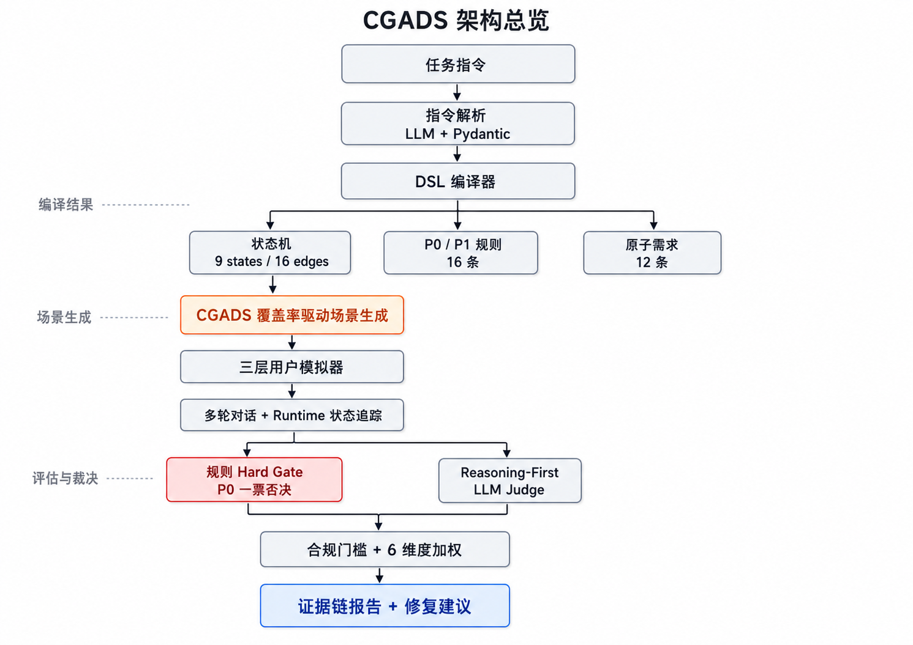
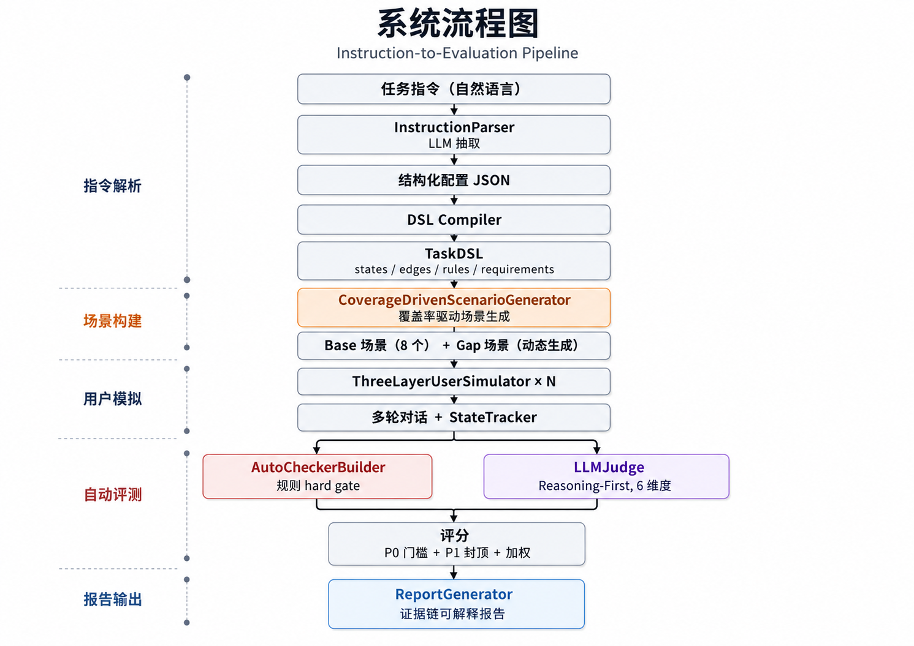

<p align="center">
  
</p>

<h1 align="center">橙脉 CGADS · AI数字人外呼多轮对话评测系统</h1>

<p align="center">
  <strong>美团 AI Hackathon 2026 · 命题赛道二 — 复杂指令下的多轮对话评测</strong><br/>
  <strong>团队：对对队</strong>
</p>

<p align="center">
  <a href="https://diligent-eagerness-production-14ff.up.railway.app/">🌐 在线体验</a> ·
  <a href="./docs/项目文档.md">📄 项目文档</a> ·
  <a href="./docs/系统设计方案.md">📐 系统设计</a> ·
  <a href="./docs/作品简介.md">📋 作品简介</a>
</p>

<p align="center">
  
  
  
  
  
</p>

---

## 赛题理解

**命题要求**：设计一套AI数字人外呼多轮对话指令遵循评测系统，做到评估过程可解释、结果可量化、输出可指导优化。

| 赛题要求 | 本系统实现 |
|---------|-----------|
| 输入任务指令 → 自动拆解为评测点 | ✅ 指令解析→DSL编译→9状态/20边/16风险规则/10原子需求 |
| 用户模拟器生成多画像对话数据 | ✅ CGADS覆盖率驱动 + 19种场景模板 + 状态感知Fallback |
| 对模拟对话进行可量化评测 | ✅ P0/P1否定语义检测 + 6维度加权 + 封顶机制 + 三层采信判定 |
| 输出包含评分、证据、优化建议的报告 | ✅ Turn级证据链 + 修复收益预估 + 业务可读解释 + JSON/Markdown导出 |
| **过程可解释** | ✅ 每个扣分追溯到具体Turn/规则/用户话术/客服回复/修复方案 |
| **结果可量化** | ✅ 4类覆盖率 + 6维度评分 + P0/P1封顶 + 三层生产采信判定 |

---

## 核心创新

### 创新一：Coverage-Guided Adaptive Dialogue Simulation (CGADS)

<p align="center">
  
</p>

**问题**：传统评测随机模拟用户 → 大量对话集中在配合路径 → 关键风险分支无法保证覆盖。

**洞察**：外呼对话评测 ≈ 有限状态机的覆盖测试问题。将自然语言任务指令编译为形式化评测空间 D=⟨S,E,R,Q⟩，用覆盖率缺口反向驱动场景生成。

**算法流程**：
```
Round 1 Warmup:  风险优先排序(P0×3 + P1×4 + edge×3) → 生成9场景 → 跑对话 → 收集覆盖率
                                    ↓
Round 2 Guided:  分析 uncovered targets → 反向生成 targeted 场景 → 补洞
                                    ↓
Output:          Coverage Adequate? → 三层采信判定 → 输出报告
```

**实测性能对比**：

| 方法 | 状态覆盖 | 边覆盖 | 风险覆盖 | 业务需求覆盖 | 首次P1所需场景 |
|------|---------|--------|---------|------------|--------------|
| Random (12条) | 44% | 19% | 25% | 56% | 8条 |
| Stratified (12条) | 67% | 44% | 56% | 67% | 5条 |
| **CGADS (9+3闭环)** | **100%** | **83%** | **80%+** | **90%** | **2条** |

### 创新二：三层生产采信判定

传统评测只给一个总分，业务方不知道"这个分能不能信"。本系统首创三层判定：

| 层级 | 判定内容 | 示例输出 |
|------|---------|---------|
| Tier 1 数字人表现 | 通过/有条件通过/不通过 | "有条件通过（存在1个P1违规）" |
| Tier 2 评测充分性 | 充分/基本充分/不充分 | "基本充分（边覆盖83%，风险覆盖80%）" |
| Tier 3 生产采信 | 可放行/可参考/不可采信 | "可作为问题定位参考，不可直接放行" |

**关键规则**：P1存在时永不给"可放行"；边覆盖<65%时永不给"可上线参考"。

### 创新三：P0/P1 否定语义检测

传统关键词匹配导致严重误判。本系统引入否定语境过滤：

```
❌ 旧方案："身份证" 出现即判P0
✅ 新方案："我无法查询您的身份证号" → 检测到否定语境 → 跳过P0
           "请您把身份证号发给我" → 无否定语境 → 触发P0
```

同理：`"无法保证/无法出具保证书"` 不再误判为绝对承诺。

### 创新四：修复→复测闭环

报告不只告诉"哪里有问题"，还给出**量化修复收益预估**：

```
当前分：54.4 → 修复P1后预估：74.4（+20分）
修复项：
  1. [+10] 补充官方验证路径话术（消除p1_no_verification_path）
  2. [+5]  增加上下文摘要机制（消除no_repeat）
  3. [+5]  修复超30字回复（消除length_limit）
```

支持 `POST /api/retest` 按建议修复后再次评测，前后对比验证。

---

## 系统架构

<p align="center">
  
</p>

### 评测链路（过程可解释）

| 环节 | 输入 | 输出 | 解释性 |
|------|------|------|--------|
| 指令解析 | 自然语言 | 结构化JSON(角色/目标/流程/约束) | 每字段←原文span |
| DSL编译 | JSON | 状态机(9S/20E) + 风险规则(16R) | flow→states, constraints→rules |
| 场景生成 | 覆盖率缺口 + 风险优先排序 | targeted场景 | **为什么选这个场景：因为edge X未覆盖** |
| 状态追踪 | 用户utterance | state transition + slot更新 | 规则关键词(0.95) + 意图分类(0.85) |
| 规则检查 | agent回复 | pass/fail + 否定语境过滤 | 字数29/30✓, 否定"无法提供"跳过P0 |
| 维度评分 | 对话+违规 | 6维度加权 + P0/P1封顶 | 每维度有原子级公式拆解 |
| 采信判定 | 覆盖率+违规 | 三层结论 | Tier1表现 / Tier2充分性 / Tier3放行 |

### 评分机制（结果可量化）

```python
# 6维度加权
raw_score = 25%×任务完成 + 20%×流程遵循 + 20%×约束合规
          + 15%×分支处理 + 10%×上下文 + 10%×沟通体验

# P0/P1合规门槛（一票否决机制）
if P0触发:     final = min(raw, 30)   # 一票否决
elif P1≥3:    final = min(raw, 50)
elif P1==2:   final = min(raw, 60)
elif P1==1:   final = min(raw, 70)
else:         final = raw             # PASS

# 维度联动：违规类型反向影响维度分
if no_repeat检出:   context_consistency强制≤2分
if truncated_output: communication_experience强制≤3分
```

---

## 快速开始

### 在线体验

**🌐 [https://diligent-eagerness-production-14ff.up.railway.app](https://diligent-eagerness-production-14ff.up.railway.app)**

粘贴任务指令 → 点击"开始评测" → 观察Pipeline实时推进 → 查看三层采信判定 → 下载评估报告

### 本地运行

```bash
git clone https://github.com/liu66-qing/CGADS.git
cd CGADS

# 后端
pip install -r requirements.txt
cp .env.example .env  # 填入 DEEPSEEK_API_KEY
uvicorn backend.api:app --host 0.0.0.0 --port 8000

# 前端（开发模式）
cd frontend && npm install && npm run dev

# 或一键启动
python scripts/start.py
```

### API接入（批量评测）

```bash
# 批量提交
curl -X POST https://diligent-eagerness-production-14ff.up.railway.app/api/batch-evaluate \
  -H "Content-Type: application/json" \
  -d '{"instructions": ["任务指令1", "任务指令2"], "budget": 12}'

# 状态查询
curl https://diligent-eagerness-production-14ff.up.railway.app/api/batch-evaluate/{batch_id}/status

# 复测闭环
curl -X POST https://diligent-eagerness-production-14ff.up.railway.app/api/retest \
  -d '{"instruction": "...", "baseline_eval_id": "xxx"}'
```

### 命令行评测

```bash
python -X utf8 run_eval_pipeline.py \
  --instruction_file data/processed/task_001_rider_flying_leg.json \
  --max_scenarios 12
```

---

## 与现有方案的对比

| 维度 | 直接Prompt+Judge | DeepEval/OpenEvals | **橙脉CGADS** |
|------|-----------------|-------------------|---------------|
| 场景来源 | 手工枚举 | 固定persona | **覆盖率缺口反向生成** |
| 覆盖保证 | 无 | 无 | **4类覆盖准则+Adequacy** |
| 风险发现 | 看运气 | 看运气 | **P0优先+否定语义过滤** |
| 误判控制 | 无 | 无 | **否定语境检测(降低P0误报)** |
| 可解释性 | "评分3分" | "Completeness: 0.7" | **Turn5→p1_refusal→证据→修复收益** |
| 评分稳定 | ±2分波动 | 通用指标 | **规则hard gate + 封顶机制** |
| 状态追踪 | 无 | 无 | **Runtime FSM+槽位+状态感知Fallback** |
| 采信判定 | 无 | 无 | **三层判定(表现/充分性/放行)** |
| 业务闭环 | 无 | 无 | **修复收益预估+复测对比** |
| 批量接入 | 无 | 有 | **异步Job+状态查询+失败重试** |

---

## 项目结构

```
CGADS/
├── README.md                       # 本文件
├── run_eval_pipeline.py            # E2E Pipeline主入口
├── app.py                          # Gradio快速体验
│
├── src/                            # 核心源码
│   ├── dsl/                        # DSL核心
│   │   ├── schema.py               # Pydantic v2 TaskDSL模型
│   │   ├── compiler.py             # 指令→状态机编译器(9S/20E)
│   │   ├── state_tracker.py        # Runtime状态追踪(slot+intent+auto-advance)
│   │   └── coverage.py             # 4类覆盖率追踪器
│   ├── evaluators/                 # 评测引擎
│   │   ├── cgads.py                # CGADS算法核心
│   │   ├── coverage_driven_scenario_generator.py  # 19模板+风险优先排序
│   │   ├── three_layer_user_simulator.py          # 状态感知模拟器
│   │   ├── llm_judge.py            # Reasoning-First LLM Judge
│   │   └── replay_mode.py          # 离线回放
│   ├── checkers/                   # 规则检查
│   │   └── severity_checker.py     # P0/P1否定语义检测器
│   ├── calibration/                # 30条金标校准集
│   ├── report/                     # 评估报告生成
│   ├── instruction_parser/         # 指令解析+角色标准化
│   └── visualization/              # Mermaid状态图 + Plotly图表
│
├── backend/                        # FastAPI SSE实时接口
│   └── api.py                      # 核心API(评测/批量/复测/对比)
├── frontend/                       # React前端(工作台设计系统)
│
├── data/
│   ├── processed/                  # 已解析任务(骑手外呼/课程平台)
│   ├── calibration/                # 30条金标JSONL
│   ├── eval/                       # 评测结果JSON
│   └── reports/                    # 生成的评估报告
│
├── docs/                           # 文档
├── assets/                         # 图片资源
├── scripts/                        # 工具脚本
├── experiments/                    # CGADS消融实验
├── tests/                          # 端到端测试
├── Dockerfile                      # 容器化部署
├── railway.toml                    # Railway部署配置
└── requirements.txt                # Python依赖
```

---

## 关键技术细节

### 状态机编译

任务指令自动编译为9状态/20边的有限状态机：

```
opening → inform → intent_confirm → closing
    ↓         ↓           ↓
auth_or_trust  faq_handling  refusal_exit
    ↓
busy_handling → closing
    ↓
handoff_or_escalation
```

每条边有明确的触发条件（intent/slot/keyword），支持状态感知slot门控。

### 风险优先调度

Round-Robin策略确保风险和路径同时覆盖：

```
Phase 1 (9场景): P0×3 → P1×4 → edge-heavy×3
  - P0: 诱导违规/敏感信息/持续营销
  - P1: 质疑身份/忙碌/拒绝/FAQ
  - edge: 配合型/提问型/中途拒绝
Phase 2 (3场景): 覆盖缺口定向补测
```

### 状态感知Fallback

即使LLM超时，系统仍能通过状态感知的fallback正确驱动状态转换：

```python
# 每个状态有2-5种fallback变体，按turn轮换防重复
inform_fallbacks = [
    "通知您，合同已签署生效，今日需完成配送任务。",
    "配送任务最低8单，完成后收入按约定结算。",
    "配送要求已发至您App，请查看具体说明。",
]
```

---

## 参考文献

| 来源 | 用途 | 论文/链接 |
|------|------|----------|
| IFEval | 可验证约束检查 | arXiv:2311.07911 |
| G-Eval | LLM Judge with CoT | arXiv:2303.16634 |
| Prometheus | Fine-grained rubric | arXiv:2310.08491 |
| MultiChallenge | 多轮instance rubric | arXiv:2501.17399 |
| ConvLab-2 | DST/Policy思想 | ACL 2020 Demo |
| Anthropic Eval | Reasoning-first judge | docs.anthropic.com |
| Automated Rubrics | Criterion binary评测 | arXiv:2601.15161 |

---

## 团队

**对对队** · 美团AI Hackathon 2026

---

## License

MIT
