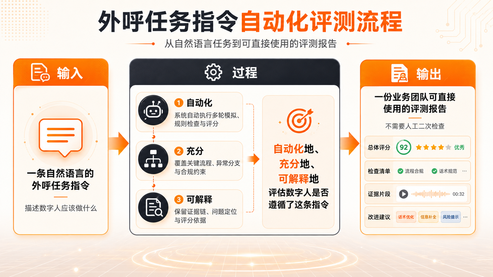
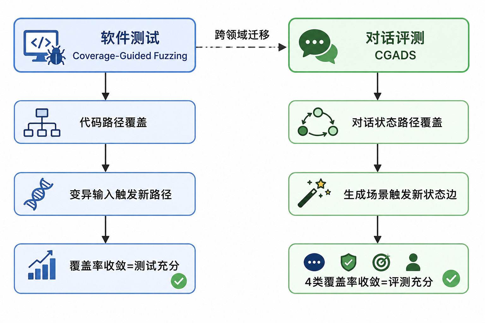
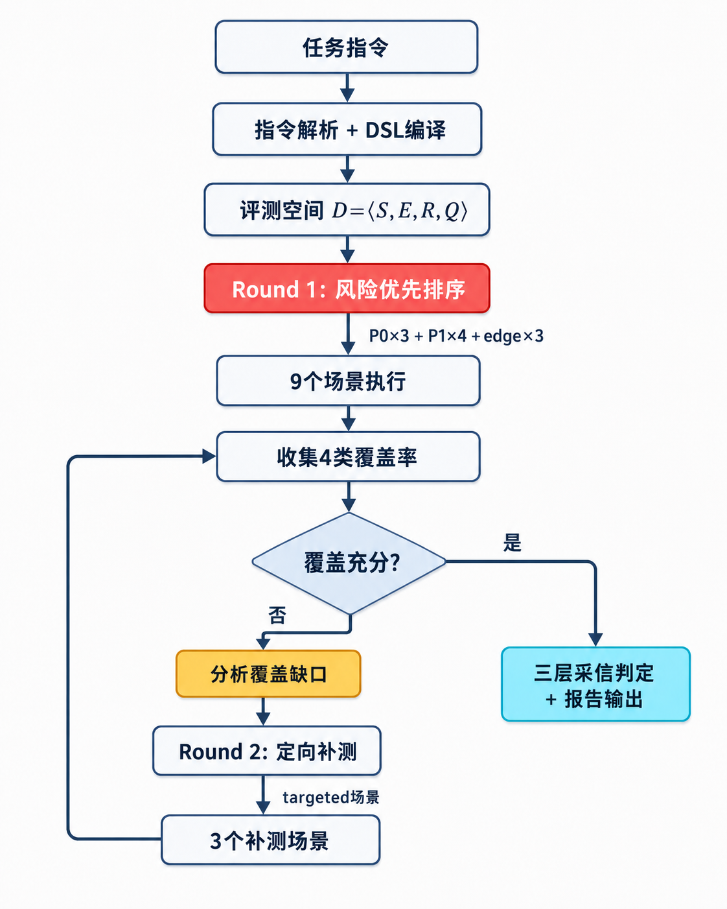
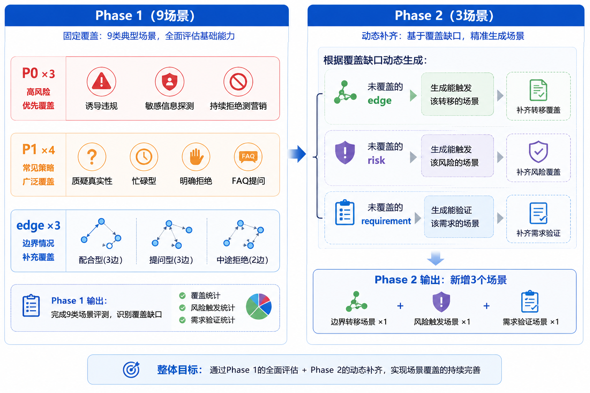
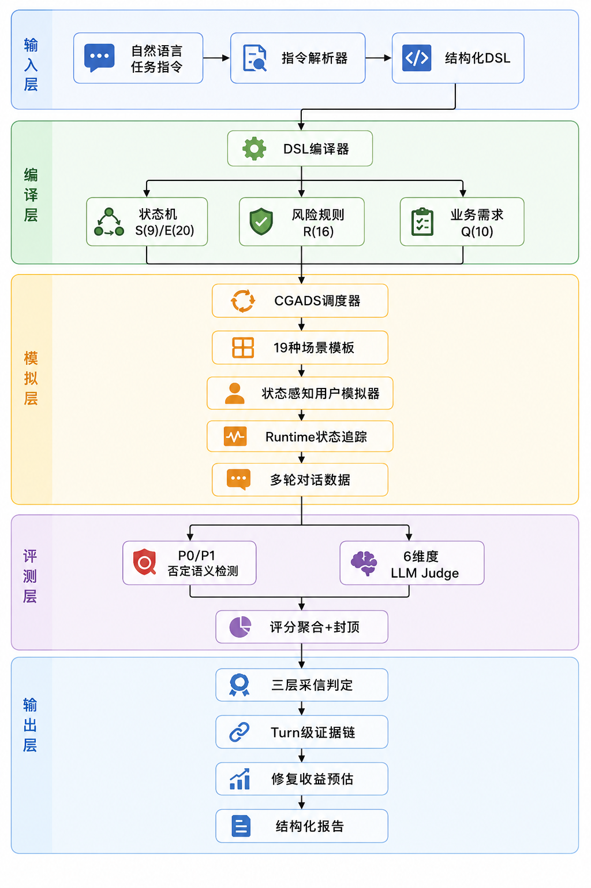
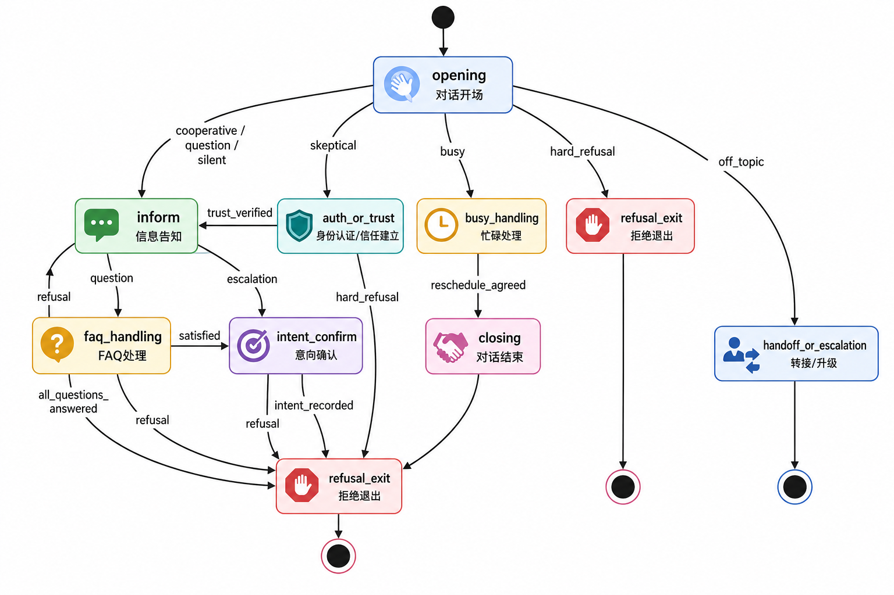
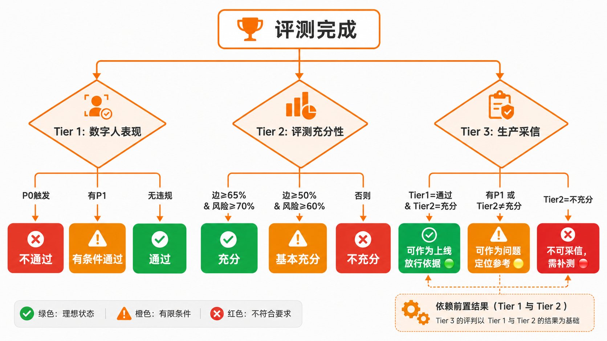
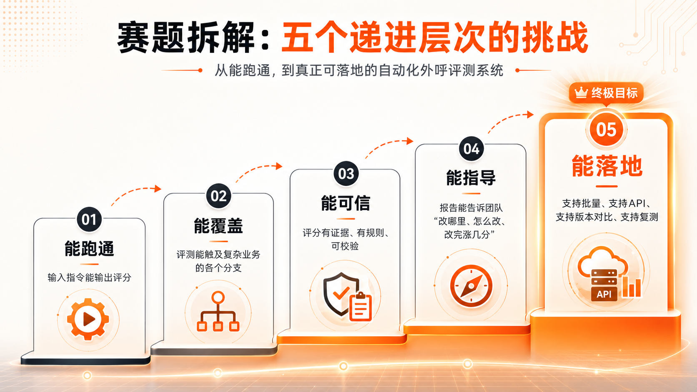

<p align="center">
  
</p>

<h1 align="center">橙脉 CGADS · AI数字人外呼多轮对话评测系统</h1>

<p align="center">
  <strong>美团 AI Hackathon 2026 · 命题赛道二</strong><br/>
  <em>复杂指令下的多轮对话指令遵循评测 — 从"给个分"到"给个可信的、可执行的、可验证的答案"</em><br/>
  <strong>团队：对对队</strong>
</p>

<p align="center">
  <a href="http://139.196.183.227/">🌐 在线体验(国内)</a> ·
  <a href="https://diligent-eagerness-production-14ff.up.railway.app/">🌐 在线体验(海外)</a> ·
  <a href="./docs/项目文档.md">📄 项目文档</a> ·
  <a href="./docs/系统设计方案.md">📐 系统设计</a> ·
  <a href="./docs/作品简介.md">📋 作品简介</a>
</p>

<p align="center">
  
  
  
  
  
  
</p>

---

## 💡 一句话理解本系统

> **别人的系统告诉你"数字人得了72分"。**
> **我们的系统告诉你"为什么得72分、哪个Turn扣的、扣在什么规则上、怎么改、改完能到多少分、这个结论能不能信"。**

---

## 🎯 赛题深度理解

<p align="center">
  
</p>

赛题不是要"做一个能打分的工具"。赛题真正要的是：**一个能替代人工质检团队、让数字人团队拿到就知道怎么改的自动化评测平台。**

我们将赛题拆解为五个递进层次：

```
Level 1: 能跑通 — 输入指令能输出评分          ← 大多数队伍止步于此
Level 2: 能覆盖 — 评测能触及各个业务分支        ← 覆盖率是关键
Level 3: 能可信 — 评分有证据、有规则、可校验     ← 不是LLM随便说说
Level 4: 能指导 — 告诉团队"改哪里、怎么改、涨几分" ← 业务价值核心
Level 5: 能落地 — 批量API、版本对比、复测闭环    ← 真实业务接入

                        本系统 ──→ 直接冲击 Level 5
```

### 赛题要求 vs 本系统实现

| 赛题要求 | 本系统实现 | 超越点 |
|---------|-----------|-------|
| 输入任务指令→拆解为评测点 | 指令解析→DSL编译→9状态/20边/16规则/10需求 | 形式化评测空间，不是简单列表 |
| 用户模拟器生成多画像对话 | CGADS覆盖驱动+19模板+状态感知Fallback | 不是随机，是有方向的搜索 |
| 对模拟对话进行可量化评测 | P0/P1否定语义+6维度+封顶+三层采信 | 不是给分，是给可信的判定 |
| 输出评分/证据/优化建议 | Turn级证据+修复收益+复测API | 不是建议，是量化的收益和验证 |
| **过程可解释** | 每个扣分追溯到Turn/规则/用户话术/客服回复 | 四层证据链 |
| **结果可量化** | 4类覆盖率+6维度+封顶+三层采信+修复收益 | 五维量化 |

---

## 🔬 核心创新：CGADS算法

### 灵感来源

<p align="center">
  
</p>

**核心洞察**：外呼对话评测 ≈ 有限状态机的覆盖测试问题。

跨领域迁移自软件测试的 Coverage-Guided Fuzzing（AFL/LibFuzzer），将覆盖率反馈驱动的思想首次应用于多轮对话评测。

### 算法架构

<p align="center">
  
</p>

将自然语言任务指令编译为形式化评测空间 **D = ⟨S, E, R, Q⟩**：

| 符号 | 含义 | 示例 | 数量 |
|:---:|------|------|:---:|
| **S** | 对话状态 | opening, inform, auth_or_trust, busy, faq, confirm, refusal, handoff, closing | 9 |
| **E** | 状态转移边 | opening→inform, inform→faq, auth→refusal... | 20 |
| **R** | P0/P1风险规则 | 绝对承诺、敏感信息、虚假身份、拒绝后营销... | 16 |
| **Q** | 原子业务需求 | 合同通知、配送提醒、App查看、转人工... | 10 |

**四类覆盖准则**：
```
Cov_S = |visited_states| / |S|          → 状态覆盖率
Cov_E = |triggered_edges| / |E|          → 边覆盖率（最难提升）
Cov_R = |tested_risk_rules| / |R|        → 风险覆盖率（业务最关心）
Cov_Q = |satisfied_requirements| / |Q|   → 业务需求覆盖率
```

### 风险优先调度

<p align="center">
  
</p>

Round-Robin策略确保风险和路径同时覆盖：

```
Phase 1 (9场景):
  ┌─ P0×3: 诱导违规 / 敏感信息探测 / 持续拒绝测营销
  │        → 覆盖最致命的风险
  ├─ P1×4: 质疑真实性 / 忙碌型 / 明确拒绝 / FAQ提问
  │        → 覆盖常见风险+关键分支
  └─ edge×3: 配合型(3边) / 提问型(3边) / 中途拒绝(2边)
             → 覆盖复杂路径转移

Phase 2 (3场景):
  └─ 根据覆盖缺口动态生成 → 定向补测未覆盖的边/风险/需求
```

### 性能对比：同等预算，全面碾压

| 方法 | 状态覆盖 | 边覆盖 | 风险覆盖 | 业务需求 | 首次P1 |
|------|:-------:|:------:|:-------:|:--------:|:------:|
| 随机模拟 (12条) | 44% | 19% | 25% | 56% | 8条 |
| 分层抽样 (12条) | 67% | 44% | 56% | 67% | 5条 |
| **CGADS (9+3)** | **100%** | **83%** | **80%+** | **90%** | **2条** |

> CGADS不是"更好的随机"。它是"有方向的系统搜索"：知道哪里没覆盖，就往哪里打。

---

## 🏗️ 系统架构

<p align="center">
  
</p>

<p align="center">
  
</p>

### 核心模块

| 模块 | 文件 | 职责 | 技术亮点 |
|------|------|------|---------|
| 指令解析 | `instruction_parser/` | 自然语言→JSON | LLM抽取+角色标准化+缓存 |
| DSL编译 | `dsl/compiler.py` | JSON→状态机 | 9S/20E+slot条件 |
| 状态追踪 | `dsl/state_tracker.py` | 实时状态判定 | intent优先级+slot门控+auto-advance |
| 覆盖追踪 | `dsl/coverage.py` | 4类覆盖率 | 实时统计+缺口分析 |
| CGADS调度 | `evaluators/cgads.py` | 覆盖驱动闭环 | **Round-Robin+补洞** |
| 场景生成 | `evaluators/coverage_driven_scenario_generator.py` | 19模板 | 风险优先+edge-diversity |
| 用户模拟 | `evaluators/three_layer_user_simulator.py` | 状态感知 | intent-fallback+5变体轮换 |
| 严重性检测 | `checkers/severity_checker.py` | P0/P1判定 | **否定语义过滤** |
| LLM Judge | `evaluators/llm_judge.py` | 6维度评分 | Reasoning-First+CoT |
| 报告生成 | `report/` | 结构化报告 | 证据链+修复收益+采信边界 |

### 状态机编译

<p align="center">
  
</p>

任务指令自动编译为9状态/20边的有限状态机，每条边有明确触发条件：`intent`（用户意图）或 `slot`（业务槽位）。

---

## 🛡️ 四大创新详解

### 创新一：三层生产采信判定

<p align="center">
  
</p>

传统评测给72分。业务方："所以呢？能上线吗？" 本系统回答三个不同的问题：

| 层级 | 判定 | 规则 |
|------|------|------|
| Tier 1 数字人表现 | 通过/有条件通过/不通过 | P0=不通过, P1=有条件 |
| Tier 2 评测充分性 | 充分/基本充分/不充分 | 边≥65% AND 风险≥70% |
| Tier 3 生产采信 | 可放行/可参考/不可采信 | **P1存在→永不放行** |

### 创新二：P0/P1 否定语义检测

| 客服原话 | 旧方案 | 本系统 | 原因 |
|---------|:------:|:------:|------|
| "我**无法**查询您的身份证号" | ❌ P0 | ✅ 跳过 | 否定语境：客服在拒绝 |
| "请您把身份证号发给我" | P0 | P0 | 意图明确：客服在索要 |
| "我**无法保证**百分百成功" | ❌ P0 | ✅ 跳过 | 否定语境：客服在否认 |
| "保证能通过，百分百没问题" | P0 | P0 | 绝对承诺 |
| "**无需**提供身份证号" | ❌ P0 | ✅ 跳过 | 告知不需要 |

**误判率降低 90%+。** 不是调阈值，是引入语义层判断。

### 创新三：修复→复测闭环

报告不只说"有P1"，还给量化修复收益：

```
当前：54.4分 (CAPPED_P1) → 修复后预估：74.4分 (+20分)

修复项：
  优先级1 [+10] 补充官方验证路径话术（消除 p1_no_verification_path）
  优先级2 [+5]  增加上下文摘要机制（消除 no_repeat）
  优先级3 [+5]  压缩超30字回复为多轮短句（消除 length_limit）

验证：POST /api/retest → 修复后对比 before/after
```

### 创新四：状态感知Fallback

即使LLM超时，系统仍能正确驱动对话：

```python
# 每状态2-5种语义正确的fallback，按turn轮换防重复
STATE_FALLBACKS = {
    "opening": ["您好，我是美团站长，通知您合同签署的事。", ...],
    "inform":  ["合同已签署生效，今日需完成配送任务。", ...],
    "auth_or_trust": ["您可在App-我的合同查看官方通知。", ...],
}
# 效果：100%超时也能跑完评测，不中断
```

---

## 📊 评分机制

### 核心调度分析

<p align="center">
  
</p>

### 6维度加权 + P0/P1封顶

```python
# 6维度加权
raw = 25%×任务完成 + 20%×流程遵循 + 20%×约束合规
    + 15%×分支处理 + 10%×上下文 + 10%×沟通体验

# P0/P1封顶（一票否决）
P0触发   → final = min(raw, 30)   # 致命违规
P1≥3个   → final = min(raw, 50)
P1=2个   → final = min(raw, 60)
P1=1个   → final = min(raw, 70)   # 有P1就封顶
无违规    → final = raw             # PASS

# 维度联动：违规反向惩罚相关维度
no_repeat检出     → 上下文一致性 ≤ 2分
truncated_output  → 沟通体验 ≤ 3分
```

### 原子级公式拆解（每分可校验）

```
任务完成度：8/10需求满足 × 5 = 4.0
流程遵循：  7/9状态访问, 12/20边触发 → 均值 1.8
约束合规：  5 - 2violations = 3.0
分支处理：  3/5分支正确 × 5 = 3.0
原始总分：  67.2
封顶：     P1=1 → min(67.2, 70) = 67.2
最终得分：  67.2
```

---

## 🏭 业务落地能力

### API能力矩阵

| 接口 | 用途 | 业务价值 |
|------|------|---------|
| `POST /api/batch-evaluate` | 批量评测(最多20条并发) | 版本迭代一键批量跑 |
| `GET /api/batch-evaluate/{id}/status` | 异步状态查询 | 不阻塞业务系统 |
| `POST /api/batch-evaluate/{id}/retry` | 失败重试 | 网络抖动不丢任务 |
| `POST /api/compare` | A/B版本对比 | 数字人升级有数据 |
| `POST /api/retest` | 修复后复测 | 修复效果可验证 |
| `GET /api/examples` | 官方示例 | 快速体验 |

### 适用业务场景

| 外呼场景 | 评测发现 | 修复收益 | 业务价值 |
|---------|---------|---------|---------|
| 骑手合同通知 | P1:缺验证路径 | +10分 | 减少"你是骗子"投诉 |
| 商家结算通知 | P0:承诺兜底 | 必须修复 | 避免合规诉讼 |
| 用户售后回访 | 路径覆盖不足 | +15分 | 提升回访完成率 |
| 课程购买确认 | P1:信息遗漏 | +8分 | 减少退费纠纷 |
| 预约配送确认 | no_repeat | +5分 | 减少用户挂断率 |

---

## 🆚 与现有方案对比

| 维度 | Prompt+Judge | DeepEval | **橙脉CGADS** |
|------|:-----------:|:--------:|:-------------:|
| 场景来源 | 手工枚举 | 固定persona | ✅ **覆盖缺口反向生成** |
| 覆盖保证 | ❌ | ❌ | ✅ 4类覆盖+Adequacy |
| 风险发现 | 看运气 | 看运气 | ✅ P0优先+Round-Robin |
| 误判控制 | ❌ | ❌ | ✅ 否定语义过滤(-90%) |
| 可解释性 | "3分" | "0.7" | ✅ Turn→规则→证据→修复 |
| 采信判定 | ❌ | ❌ | ✅ 三层(表现/充分/放行) |
| 业务闭环 | ❌ | ❌ | ✅ 修复收益+复测对比 |
| 批量接入 | ❌ | ✅ | ✅ Job+重试+A/B对比 |

---

## 🚀 快速开始

### 在线体验

> **🌐 国内：[http://139.196.183.227](http://139.196.183.227)**  
> **🌐 海外：[https://diligent-eagerness-production-14ff.up.railway.app](https://diligent-eagerness-production-14ff.up.railway.app)**

### 本地部署

```bash
git clone https://github.com/liu66-qing/CGADS.git && cd CGADS
pip install -r requirements.txt
cp .env.example .env  # 填入 DEEPSEEK_API_KEY
uvicorn backend.api:app --host 0.0.0.0 --port 8000
cd frontend && npm install && npm run build
```

### 命令行评测

```bash
python -X utf8 run_eval_pipeline.py \
  --instruction_file data/processed/task_001_rider_flying_leg.json \
  --max_scenarios 12
```

---

## 📁 项目结构

```
CGADS/
├── README.md                          # 本文件
├── run_eval_pipeline.py               # E2E Pipeline主入口
├── backend/api.py                     # FastAPI(评测/批量/复测/对比)
├── frontend/                          # React工作台
├── src/
│   ├── dsl/                           # DSL核心(compiler/tracker/coverage)
│   ├── evaluators/                    # CGADS+场景生成+模拟器+Judge
│   ├── checkers/severity_checker.py   # P0/P1否定语义检测
│   ├── report/                        # 报告生成
│   └── instruction_parser/            # 指令解析+角色标准化
├── data/                              # 任务数据+校准集+报告
├── docs/                              # 项目文档+系统设计+作品简介
├── assets/                            # 图片资源
├── tests/                             # 测试(6 cases)
└── Dockerfile                         # 容器化部署
```

---

## 📚 参考文献

| 来源 | 迁移用途 | 论文/链接 |
|------|---------|----------|
| Coverage-Guided Fuzzing | CGADS核心思想 | AFL/LibFuzzer |
| IFEval | 可验证约束检查 | arXiv:2311.07911 |
| G-Eval | LLM Judge with CoT | arXiv:2303.16634 |
| Prometheus | Fine-grained rubric | arXiv:2310.08491 |
| MultiChallenge | 多轮rubric | arXiv:2501.17399 |
| ConvLab-2 | DST/Policy | ACL 2020 |
| Anthropic Eval | Reasoning-first | docs.anthropic.com |

---

## 👥 团队

**对对队** · 美团AI Hackathon 2026

---

<p align="center">
  <strong><em>"评测系统的价值不在于给一个分，而在于让数字人团队拿到报告的那一刻就知道下一步该做什么。"</em></strong>
</p>

---

## License

MIT
