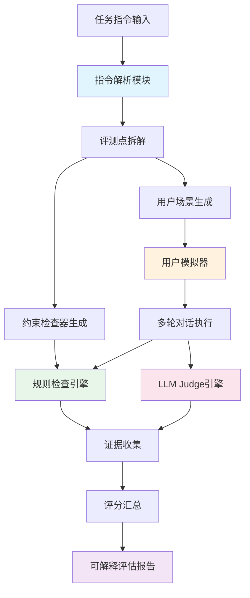

# 美团多轮对话指令遵循评测系统设计方案

**第一步：赛题理解**

## 核心诉求

### 问题定位
外呼AI数字人需处理复杂任务指令，但现有评测手段不足：
- 任务描述非结构化（流程图、文字说明、FAQ混合）
- 需覆盖多种用户画像（配合/拒绝/质疑/跑题...）
- 现有评测依赖人工标注，成本高、覆盖率低
- 缺乏可解释性：分数无证据链，无优化方向

### 赛题目标
构建一套**全自动、可解释、可量化**评测系统：
1. **输入**：任意格式任务指令（如示例Excel中结构化prompt）
2. **输出**：评估报告（总分、分项、证据、失败轨迹、优化建议）
3. **中间过程**：
   - 自动拆解任务为可验证评测点
   - 自动生成多画像用户模拟对话
   - 对模拟对话自动打分

### 评委关注点（推测）
1. **可解释性** > 准确率：不能是黑盒分数，要能追溯到具体对话轮次
2. **覆盖率**：能否覆盖任务中所有分支（FAQ、异常、拒绝场景）
3. **工程质量**：系统是否模块化、可复用、可落地
4. **技术先进性**：是否基于顶会论文/知名开源项目
5. **创新点**：相比现有方案（人工标注、单指标评测），核心创新在哪

---

## 第二步：模块化架构设计

### 系统架构图



### 核心模块与技术来源

#### 模块1：任务指令解析模块

**职责**：将任意格式任务指令 → 结构化JSON

**来源**：自建（已实现 `src/instruction_parser/auto_parser.py`）

**输入示例**：
```text
# Role: 美团外卖骑手客服
# Task: 通知骑手"抽奖券"活动，告知签约合同成功
# Opening Line: 您好，我是${rider_name}，美团外卖...
# Call Flow: 1. 告知新将奖励... 2. 说明续费...
# Constraints: 每次回复约30字以内...
```

**输出JSON**：
```json
{
  "task_id": "rider_lottery_notify",
  "role": "美团外卖骑手客服",
  "goal": "通知签约成功并说明奖励",
  "flow": [
    {"step_id": "step_1", "condition": "开场", "action": "告知奖励活动"},
    {"step_id": "step_2", "condition": "用户同意", "action": "说明续费金额"}
  ],
  "constraints": ["回复不超过30字", "不能回答职责范围外问题"],
  "forbidden": ["好的", "嗯嗯", "谢谢"],
  "max_reply_length": 30
}
```

**技术细节**：
- 用DeepSeek/GPT-5提取结构
- 鲁棒JSON解析（支持代码块、尾逗号、单引号）
- 正则后处理提取禁用词、字数限制

---

#### 模块2：评测点拆解与检查器自动生成

**职责**：从任务配置生成可程序化约束检查规则

**来源**：
- **IFEval (Google 2023)**：可验证指令遵循评测
  - 论文：Instruction-Following Evaluation（`paper/IFEval_中文翻译.md`）
  - 核心思想：将指令拆解为25类可验证约束（如length、keywords、forbidden_words）
- **实现**：自建 `src/checkers/auto_checker_builder.py`

**生成的检查规则示例**：
```python
[
  Rule("length_limit", lambda reply: len(reply) <= 30),
  Rule("forbidden_words", lambda reply: "好的" not in reply),
  Rule("no_repeat", lambda reply, history: reply not in history),
  Rule("end_condition", lambda reply, user: "再见" in reply if "开车" in user)
]
```

**选型理由**：
- IFEval证明：可验证约束比纯LLM Judge更稳定
- 业务强规则（字数、禁用词）不该用LLM判断 → 用规则检查
- 自动生成避免手工枚举规则

---

#### 模块3：用户模拟器

**职责**：从任务配置自动生成多画像用户，模拟真实外呼场景

**来源优选**：
1. **OpenEvals (LangChain)**
   - 仓库：https://github.com/langchain-ai/openevals
   - 核心能力：`create_llm_simulated_user`、`run_multiturn_simulation`
   - 优点：已集成LangChain、支持多轮trajectory评测、工程成熟
   - 用法：
     ```python
     from openevals.simulation import create_llm_simulated_user
     user_sim = create_llm_simulated_user(
         persona="质疑诈骗型用户，担心外呼是骗子",
         goal="确认电话真实性后才配合",
         behavior_guide="前3轮反复质疑来源，需要明确证据才信任"
     )
     ```

2. **prompt-based-user-simulator (TelepathyLabs)**
   - 仓库：https://github.com/telepathylabsai/prompt-based-user-simulator
   - 论文：https://arxiv.org/abs/2306.00774
   - 优点：基于ConvLab-2任务型对话、支持状态追踪
   - 用法：借鉴其Persona Prompt模板设计

**当前实现**：`src/evaluators/scenario_generator.py` + `src/evaluators/user_simulator.py`

**生成的用户画像类型**：
```python
personas = [
    {"name": "配合型", "behavior": "快速确认，不多问"},
    {"name": "质疑诈骗型", "behavior": "前3轮质疑真实性，需明确证明"},
    {"name": "明确拒绝型", "behavior": "第2轮直接拒绝，态度坚定"},
    {"name": "忙碌急躁型", "behavior": "催促快讲，不耐烦"},
    {"name": "跑题型", "behavior": "反复问无关问题"},
    {"name": "连续提问型", "behavior": "每轮问FAQ中不同问题"},
    {"name": "诱导违规型", "behavior": "要求承诺、突破规则"},
    {"name": "沉默短回复型", "behavior": "只说"嗯"、"哦""}
]
```

**选型理由**：
- OpenEvals：工程成熟、与LangChain集成好 → 主力方案
- prompt-based-user-simulator：Prompt模板设计优秀 → 借鉴
- UserSimCRS：过重（需Agenda-based），外呼场景不需要 → 不用
- 自建 `ScenarioGenerator`：从任务配置自动生成画像（避免手工穷举）

---

#### 模块4：多轮对话执行引擎

**职责**：驱动用户模拟器与被测数字人交互

**来源**：自建 `src/response_generator/engine.py`

**核心逻辑**：
```python
dialogue = DialogueEngine(agent=被测系统, user_sim=用户模拟器)
history = dialogue.run(max_turns=15, persona=persona_config)
# 返回完整对话历史：[{role, content, timestamp}]
```

---

#### 模块5：混合评测引擎

**职责**：对完整对话进行双重评测（规则 + LLM Judge）

**架构**：
```
对话历史 → [规则检查引擎] → 硬约束违规点
         ↘ [LLM Judge引擎] → 软质量评分（连贯性、话术自然度）
           ↓
        [证据融合] → 最终评分报告
```

##### 5.1 规则检查引擎

**来源**：自建 `src/checkers/auto_checker_builder.py`

**检查维度**：
- 字数限制、禁用词、重复回复
- 结束条件处理（如"用户在开车"需立即结束）
- 违规承诺检查（如"保证""一定"）

**输出示例**：
```json
{
  "turn": 3,
  "user": "你们这是诈骗吧？",
  "agent": "不是的，这是官方活动，保证真实有效",
  "violations": [
    {"rule": "forbidden_words", "message": "包含禁用词'保证'"}
  ]
}
```

##### 5.2 LLM Judge引擎

**来源**：
1. **DeepEval (Confident AI)**
   - 文档：https://deepeval.com/guides/guides-multi-turn-evaluation
   - 核心指标：
     - `ConversationCompleteness`：任务是否完成
     - `KnowledgeRetention`：多轮记忆一致性
     - `RoleAdherence`：角色遵守
     - `TurnRelevancy`：单轮相关性
     - `ConversationalGEval`：自定义自然语言rubric
   - 优点：内置多轮指标、输出reasoning、与pytest集成
   - **为什么选它**：
     - 文档完善、开箱即用
     - `ConversationalGEval`支持自定义评分标准（适配赛题）
     - 输出包含reasoning（满足可解释性要求）

2. **MLflow Multi-Turn Evaluation**
   - 文档：https://mlflow.org/docs/latest/genai/eval-monitor/running-evaluation/multi-turn/
   - 内置judges：ConversationCompleteness、UserFrustration、Safety
   - 优点：企业级、支持trace监控
   - **为什么不选**：需MLflow服务、工程依赖重

**当前实现**：自建 `src/evaluators/llm_judge.py`（轻量版DeepEval思想）

**评测维度**（参考DeepEval + MultiChallenge）：
```python
# 单轮评分（1-5分）
turn_score = {
    "cohesion": 连贯性（是否答非所问）,
    "knowledge": 知识一致性（是否符合FAQ）,
    "compliance": 合规性（是否违反约束）,
    "progress": 任务推进（是否向目标前进）
}

# 整通电话评分
dialogue_score = {
    "task_completed": bool,
    "natural_ending": bool,
    "faq_handled": bool,
    "flow_followed": bool,
    "user_experience": 1-5,
    "overall": 1-5,
    "strengths": [优点],
    "weaknesses": [不足],
    "suggestions": [改进建议]
}
```

**选型理由**：
- DeepEval：最成熟的多轮LLM Judge框架 → **主力参考**
- 自建轻量版：避免框架依赖、保持灵活性
- 未来升级路径：集成DeepEval完整版

---

#### 模块6：证据收集与可解释报告生成

**职责**：将评分结果追溯到具体对话轮次，输出带证据链的报告

**来源**：
- **RankJudge (arXiv 2605.21748)**：证明多轮Judge需明确失败点
- **MultiChallenge (arXiv 2501.17399)**：instance-level rubrics思想
- 自建报告生成器

**报告结构**：
```markdown
# 外呼数字人评估报告

## 总体评分：76.4/100

## 分维度得分
- 任务完成度：24/30
- 关键约束遵循：16/20
- 条件分支处理：8/15（主要失败点）
- 多轮上下文保持：8/10
- 流程顺序：7/10
- 话术质量：9/10
- 用户体验：4/5

## 关键失败点

### 失败点1：用户质疑真实性时解释不充分
- **场景**：质疑诈骗型用户
- **失败轮次**：Turn 2-4
- **证据**：
  ```
  Turn 2
  用户：你们这是诈骗吧？
  客服：不是的，这是官方活动
  [违规] 未提供具体证据（如官网链接、客服工号）
  ```
- **扣分**：-5分（条件分支处理维度）
- **优化建议**：增加话术"您可以在美团App-我的-消息中心查看官方通知"

### 失败点2：用户明确拒绝后仍推进业务
- **场景**：明确拒绝型用户
- **失败轮次**：Turn 5
- **证据**：
  ```
  Turn 4
  用户：我不需要，别打了
  客服：那您看一下奖励内容...（继续说明）
  [违规] 未遵守"拒绝后礼貌结束"约束
  ```
- **扣分**：-8分（约束遵循 + 用户体验）
- **优化建议**：识别明确拒绝信号 → 触发礼貌退出分支

## 用户类型覆盖情况
- ✓ 配合型（5/5通过）
- ✗ 质疑诈骗型（1/5通过）← **重点改进**
- ✗ 明确拒绝型（0/5通过）← **重点改进**
- ✓ 忙碌型（4/5通过）
- △ 连续提问型（3/5通过）

## 优化优先级
1. **P0（阻断问题）**：拒绝用户未正确结束 → 导致骚扰投诉
2. **P1（高频问题）**：质疑场景解释不足 → 完成率低
3. **P2（体验优化）**：FAQ回答不够口语化
```

---

## 评测指标体系

### 维度权重设计

| 维度 | 权重 | 评测方式 | 参考来源 |
|------|------|----------|----------|
| 任务完成度 | 30% | LLM Judge | DeepEval.ConversationCompleteness |
| 关键约束遵循 | 20% | 规则检查 | IFEval |
| 条件分支处理 | 15% | LLM Judge | MultiChallenge rubrics |
| 多轮上下文保持 | 10% | LLM Judge | DeepEval.KnowledgeRetention |
| 流程顺序与状态推进 | 10% | 规则+状态机 | CL-Bench思想 |
| 话术质量 | 10% | LLM Judge | G-Eval |
| 用户体验/满意度 | 5% | LLM Judge | user-satisfaction-simulation |

### 规则检查 vs LLM Judge 分工

**规则检查**（确定性、无争议）：
- 字数限制
- 禁用词
- 重复回复
- 结束条件触发
- 违规承诺关键词

**LLM Judge**（语义理解、主观判断）：
- 连贯性（是否答非所问）
- 知识一致性（是否符合FAQ语义）
- 任务推进（是否向目标前进）
- 话术自然度
- 用户情绪识别

---

## 数据流图

```
任务指令（纯文本）
  ↓
[指令解析器 LLM]
  ↓
结构化配置JSON
  ↓
  ├→ [约束检查器生成] → 规则列表
  └→ [场景生成器] → 用户画像列表
       ↓
    [用户模拟器 LLM] × N画像
       ↓
    [多轮对话执行] → 对话历史×N
       ↓
    ┌──────────┴──────────┐
    ↓                     ↓
[规则检查引擎]      [LLM Judge引擎]
    ↓                     ↓
 违规点列表          质量评分+reasoning
    └──────────┬──────────┘
               ↓
         [证据融合]
               ↓
       评分 + 证据 + 建议
               ↓
      [报告生成器 Markdown]
```

---

## 技术选型总结表

| 模块 | 方案 | 来源 | 理由 |
|------|------|------|------|
| 指令解析 | LLM提取结构 | 自建 | 任务指令格式不统一，LLM最灵活 |
| 评测点拆解 | 可验证约束自动生成 | IFEval思想 | 避免纯LLM Judge不稳定性 |
| 用户模拟器 | OpenEvals框架 | LangChain开源 | 工程成熟、支持多轮、易集成 |
| 用户画像Prompt | prompt-based-user-simulator | TelepathyLabs论文 | Persona设计最佳实践 |
| 规则检查 | 自动规则生成器 | 自建（IFEval启发） | 可复用、可解释 |
| LLM Judge指标 | 多轮对话专用指标 | DeepEval框架 | 内置指标最全、支持reasoning |
| 报告生成 | Markdown模板 | 自建 | 可读性强、易扩展 |
| 整体框架 | Pipeline式串联 | 自建 | 比LangGraph/DSPy更轻、更透明 |

---

## 实施计划

### 阶段1：核心流程打通（已完成80%）
- [x] 指令解析器
- [x] 约束检查器自动生成
- [x] 场景生成器
- [x] 用户模拟器基础版
- [x] LLM Judge基础版
- [ ] **待完善**：集成OpenEvals的用户模拟器

### 阶段2：评测指标完善（剩余核心）
- [ ] 接入DeepEval的ConversationalGEval（自定义rubric）
- [ ] 增加状态追踪模块（参考CL-Bench）
- [ ] 完善证据抽取逻辑（失败轨迹可视化）

### 阶段3：报告生成与优化
- [ ] Markdown报告模板
- [ ] 失败对话片段高亮
- [ ] 优化建议生成（LLM驱动）

### 阶段4：工程化与Demo
- [ ] Web界面（Gradio，已有app.py）
- [ ] 批量评测接口
- [ ] 评测结果对比（不同版本数字人）

### 预计工作量
- 阶段2：3天
- 阶段3：2天
- 阶段4：2天
- **总计7天**（单人全职）

---

## 风险点与应对

### 风险1：LLM Judge不稳定
**表现**：同一对话多次评分差异大

**应对**：
1. 降低temperature（0.2）
2. 多次采样取众数（3-5次）
3. 关键硬约束用规则检查，不依赖LLM

### 风险2：用户模拟器不够真实
**表现**：生成对话过于配合，不像真人

**应对**：
1. 借鉴prompt-based-user-simulator的Persona模板
2. 给画像增加"隐藏状态"（如"会在第3轮爆发"）
3. 从真实外呼录音中提取用户行为模式

### 风险3：场景覆盖率不足
**表现**：生成的画像无法覆盖所有任务分支

**应对**：
1. 从flow的每个branch自动生成场景（已实现）
2. 手动补充极端场景（诱导违规、投诉型）
3. 评测报告输出"未覆盖分支列表"

### 风险4：评分权重主观性强
**表现**：评委质疑"为什么任务完成度30%，话术质量才10%"

**应对**：
1. 提供权重可调接口（配置文件）
2. 参考业界标准（参考user-satisfaction-simulation的满意度分布）
3. 评测报告展示"如果权重调整为X，分数变为Y"

### 风险5：竞争对手也用类似方案
**表现**：大家都用DeepEval + OpenEvals

**应对**：核心差异化见下节

---

## 创新点与差异化亮点

### 亮点1：任务指令全自动拆解 → 评测点
**创新**：无需人工标注评测标准，从任务描述自动生成

**对比**：
- 传统方案：需专家定义每个任务的评测rubric（人工成本高）
- 本方案：LLM自动解析 → 规则自动生成

**体现位置**：`InstructionParser` + `AutoCheckerBuilder`

### 亮点2：混合评测架构（规则 + LLM Judge）
**创新**：硬约束用规则、软质量用LLM，优势互补

**对比**：
- 纯LLM Judge：不稳定、难复现
- 纯规则：无法评价语义、连贯性
- 本方案：两者融合，可解释性强

**理论支撑**：IFEval论文证明规则检查比LLM更可靠

### 亮点3：用户画像自动生成 + 覆盖率追踪
**创新**：从任务流程自动生成画像，并追踪哪些分支未覆盖

**对比**：
- 传统方案：手工枚举用户类型（易遗漏）
- 本方案：从flow的branches自动生成 → 保证覆盖率

**体现位置**：`ScenarioGenerator._from_flow()`

### 亮点4：证据链可追溯
**创新**：每个扣分点必须引用具体对话轮次、违规内容、规则ID

**对比**：
- 传统方案：只给总分或维度分，无证据
- 本方案：报告中直接展示"Turn 3违反了rule_forbidden_words，证据：..."

**理论支撑**：RankJudge论文强调失败点注入验证

### 亮点5：优化建议自动生成
**创新**：不只指出问题，还给出具体话术改进方向

**实现方式**：
- 失败场景 → LLM生成改进话术 → 对比原话术 → 输出diff

### 亮点6：方案完全基于顶会论文/知名开源
**体现学术功底**：
- MultiChallenge (2025 顶会)
- IFEval (Google)
- DeepEval (GitHub 3k+ stars)
- OpenEvals (LangChain官方)
- prompt-based-user-simulator (ConvLab-2)

---

## 对比现有队伍可能方案

| 方案类型 | 可能采用技术 | 我们的优势 |
|----------|--------------|------------|
| 纯LLM Judge | GPT-5一把梭 | 我们有规则检查兜底，更稳定 |
| 纯规则检查 | 正则匹配 | 我们有LLM Judge评价语义 |
| 人工标注 | 标注平台 | 我们全自动，成本低 |
| 使用DeepEval框架 | 直接调用 | 我们自建指令解析+场景生成，定制化更强 |
| 使用LangChain | Agent编排 | 我们更轻量，Pipeline式更透明 |

---

## Plan B 预案

### 如果OpenEvals集成失败
→ 用自建 `UserSimulator`（已实现，`src/evaluators/user_simulator.py`）

### 如果DeepEval指标不适配
→ 用自建 `LLMJudge`（已实现，`src/evaluators/llm_judge.py`）

### 如果LLM Judge成本过高
→ 增加缓存机制，相同对话不重复评测

### 如果评测时间过长
→ 并行评测多个场景（asyncio）

---

## 下一步行动

**立即执行**：
1. 完善 `src/evaluators/user_simulator.py`，集成OpenEvals的Persona模板
2. 补充DeepEval的ConversationalGEval自定义rubric
3. 实现报告生成器 `src/report_generator.py`

**待codex质疑后迭代**：
- 根据反馈调整权重、指标
- 补充遗漏的论文引用
- 完善Plan B方案
